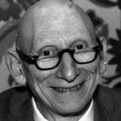

name: Alan Jay Perlis  
image: [img/alan-perlis.jpg](img/alan-perlis.jpg)  
period: 1950s  

---------

### short bio
US mathematician and computer scientists, pioneer of CS education.

### affiliations
 - MSc & PhD from MIT in 1950
 - professor at Purdue University (1950s), Carnegie (1960s) and Yale University (from 1970s)

 - president of ACM in 1962
 - editor-in-chief of CACM (1958-62)
 - first recipient of the Turing Award in 1966

 - participated in Project Whirlwind at MIT
 - member of the team that developed ALGOL

### notable concepts
 - "Computer Science"
 - "Turing tarpit" ("in which everything is possible but nothing of interest is easy")
 - [Logic Theorist](https://en.wikipedia.org/wiki/Logic_Theorist) - earliest AI program that proved 38 of the first 52 theorems from "Principia Mathematica" and was presented at the Dartmouth conference of 1956
 - "major problem" in CS is bridging the gap between neuroscience and psychology

### whom did this influence
 - Herbert Simon and Allen Newell, 1975 Turing Award winners for contributions to artificial intelligence and the psychology of human cognition

### what to read
 - [Epigrams on Programming](https://archive.is/Oa7dH) 1982 ACM paper, early programming lore
 - [Alan J. Perlis—1922–1990: a founding father of computer science as a separate discipline]() 1990 CACM paper
 - 1981 talk on ["Computing in the Fifties"](https://archive.is/Vn6lp)  

### what to watch
 -
