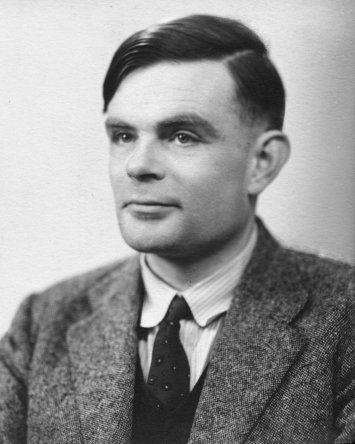

name: Alan Turing

image: 

period: 1930s

### short bio
English mathematician, computer scientist, logician, cryptanalyst, philosopher.
Was breaking German ciphers during WWII and designing electronic stored-program computer (ACE).
With his 1936 paper kicked of what became a theoretical computer science that defined what is now known as the "Universal Turing machine".

### affiliations
 - graduated Cambridge
 - worked at the National Physical Laboratory
 - worked at Victoria University of Manchester
 - Turing showed Shannon his seminal paper

### notable concepts
 - Turing machine
 - Turing test

### whom did this influence
 - Everyone

### what to read
 - Paper "On computable numbers with an application to the entscheidungsproblem", 1936
 - Book "Annotated Turing" that works though his seminal paper
 - [Chapter 3](http://www.rheingold.com/texts/tft/03.html#Chap03) in book "Tools for Thought"
 - Biography book "Alan Turing: The Enigma"

### what to watch
 - Movie "The Imitation Game"
