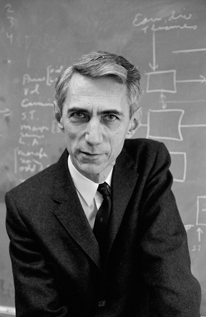

name: Claude Shannon  
image: [img/claude-shannon.jpeg](img/claude-shannon.jpeg) _(Photo: Alfred Eisenstaedt/The LIFE Picture Collection/Getty Images)_ 
period: 1950s  

------

### short bio
American mathematician, electrical engineer, and cryptographer. 
Founder of "information theory".

### affiliations
 - Graduated MIT (Ph.D), 1940
 - Tought by [Vannevar Bush](vannevar-bush.md), worked on early analog computer - differential analyzer
 - Worked at Institute for Advanced Study

### notable concepts
 - electrical applications of Boolean algebra
 - "information entropy"

### whom did this influence
 - Richard Hamming
 - Everyone

### what to read
 - His book ["The Mathematical Theory of Communication"](https://en.wikipedia.org/wiki/A_Mathematical_Theory_of_Communication), 1964
 - [Chapter 6](http://www.rheingold.com/texts/tft/06.html#Chap06) in book "Tools for Thought"

### what to watch
 - Documentatry movie ["The Bit Player"](https://www.imdb.com/title/tt5015534/), post-production 2018 ([trailer](https://vimeo.com/288625027))
 - Videos from ["Claude Shannon Conference"](https://www.youtube.com/playlist?list=PLZ4JlAKnv384PiK8mUd4SmzC5BwMbnfUY), 2016
