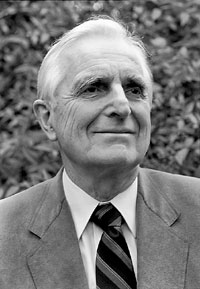

name: Douglas Engelbart  
image: [img/douglas-engelbart.jpeg](img/douglas-engelbart.jpg)  
period: 1960s  

--------

### short bio
After the army, 35 y.o switched to studing engineering.
Envisioned and helped building a working hardware+software system in 1968 at SRI, NLS that prototypes all personal computing today: keyboard, mouse, video-conference, web, etc.

### affiliations
 - PhD in Berkeley
 - Worked at SRI Augmentation Research Center
 - ARPA funded the work
 - Created Bootstrap Institute

### notable concepts
 - Argumenting human inteligence
 - oNLine System (NLS)
 - mouse
 - "Mother of all demos"
 - Bootstrapping

### whom did this influence
 - Alan Kay
 -

### what to read
 - [Chapter 9](http://www.rheingold.com/texts/tft/09.html#Chap09) of the book "Tools for Thoughs"
 - https://www.ibiblio.org/pioneers/engelbart.html
 - http://dougengelbart.org

### what to watch
 - Original Dec 9th, 1968 ["Mother of All demos"](http://www.dougengelbart.org/content/view/374/464/)
 - http://dougengelbart.org/content/view/258/000/
 - Documentary movie ["The Augmentation of Douglas Engelbart"](http://www.augmentationfilm.com), to be released in 2019
 - 
