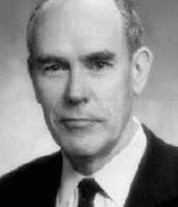

name: Ivan Sutherland  
image: [img/ivan-sutherland.png](img/ivan-sutherland.png)  
period: 1960s  

-----

### short bio
Worked interactive computing and CGI. On TX-2 computer he developed a software+input device for interactive computer graphics. Experimented with first virtual reality system.

### affiliations
 - Carnegie Institute of Technology (B.S., 1959)
 - Caltech (M.S., 1960)
 - MIT (Ph.D., 1963)
 - Tought by [Claud Shennon](claude-shannon.md), Marvin Minsky
 - DARPA, replaced [J.C.R. Licklider](jcr-licklider.md) when he returned to MIT, 1964
 - Associate Professor of Electrical Engineering at Harvard
 - Professor at the University of Utah
 - Professor of Computer Science at Caltech
 - Worked at RAND's Information Sciences Department, 1974-1986
 - Worked as Fellow and Vice President at Sun Microsystems
 - Founder of successful flight-simulation company [Evans&Sutherland](http://www.es.com)

### notable concepts
 - Sketchpad

### whom did this influence
 - Doug Engelbart
 - Alan Kay

### what to read
 - PhD thesis ["Sketchpad, A Man-Machine Graphical Communication System"]( https://www.cl.cam.ac.uk/techreports/UCAM-CL-TR-574.pdf)
 - Article "On courage in Technology"
 - [Chapter 14](http://www.rheingold.com/texts/tft/14.html) in book "Tools for Thought"
 - [Turing Award materials](https://amturing.acm.org/award_winners/sutherland_3467412.cfm), 1988

### what to watch
 - original demo of the scetchpad, 1963 https://www.youtube.com/watch?v=57wj8diYpgY
 - Alan Kay lecture, showing summer 1962 demo of scetchpad https://www.youtube.com/watch?v=495nCzxM9PI
 - Sketchpad demo with author's comments https://www.youtube.com/watch?v=-sbeghygOt4, 1994
 - Lecture ["Some Thoughts About Concurrency"](https://www.youtube.com/watch?v=jR9pAaQlVRc), 2010
