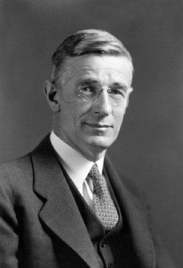

name: Vannevar Bush

image: 

period: 1940s

### short bio
American engineer, inventor and science administrator who coordinated work on 6000+ scientists though WWII. Worked on analog computers, "difference engine", proposed Memex concept after the war. 1940 rejection of Norbert Wiener's proposal on building a digital computer.

### affiliations
 - MIT
 - Manhattan Project
 - AT&T Board member

### notable concepts
 - Differential analyzer (TK link!)
 - [Memex](https://en.wikipedia.org/wiki/Memex) hypothetical proto-hypertext system described in 1945

### whom did this influence
 - Douglas Engelbart, who read "As we may think" in '45
 - Claude Shannon, who was his student

### what to read
 - Article ["As we may think"](https://web.archive.org/web/20011215033047id_/http://www.isg.sfu.ca:80/~duchier/misc/vbush/vbush-all.shtml) in Atlantic Monthly, July 1945
 - Book ["From Memex to Hypertext: Vannevar Bush and the Mind's Machine"](https://archive.org/details/FromMemexToHypertext), 1991 by James M. Nyce and Paul Kahn
 - https://www.ibiblio.org/pioneers/bush.html

### what to watch
 - MIT/Brown [Vannevar Bush symposium](http://dougengelbart.org/content/view/258/000/), celebrating the 50th anniversary of "As we may think" pubilcation, 1995
